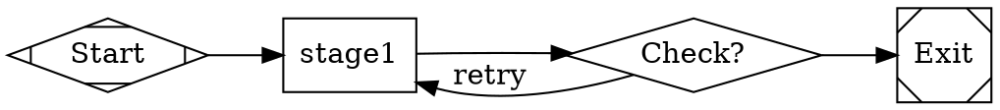

# Pipeline Runner Contract

## Overview

SF Factory pipelines are defined as DOT (Graphviz) files. Each pipeline describes a directed acyclic graph (DAG) of stages with execution semantics, retry logic, and LLM model routing.

This document defines the **contract** between pipeline definitions (`.dot` files) and the pipeline runner (executor).

## Pipeline File Structure

A pipeline is a DOT digraph with:
- **Graph attributes**: Global pipeline configuration
- **Nodes**: Stages (work units) and control flow (decisions)
- **Edges**: Stage transitions with conditions

### Example Pipeline Structure



## Graph Attributes

Graph-level attributes apply to the entire pipeline.

### Required Attributes

| Attribute | Type | Description | Example |
|-----------|------|-------------|---------|
| `goal` | string | High-level pipeline objective | `"Build a new product from template to MVP"` |
| `rankdir` | string | Graph layout direction (LR or TB) | `LR` (left-to-right) |
| `default_max_retry` | integer | Default retry limit per stage | `2` |
| `max_restarts` | integer | Maximum total restarts before abort | `60` |
| `retry_target` | string | Stage name to restart from on failure | `"plan"` |
| `model_stylesheet` | string | CSS-like LLM model routing rules | See below |

### Model Stylesheet

Defines which LLM model to use for stages with a given class:

```css
.plan { llm_model: opusplan; llm_provider: anthropic; }
.implement_fast { llm_model: gpt-5.3-codex-spark; llm_provider: openai; reasoning_effort: xhigh; }
.implement_deep { llm_model: gpt-5.3-codex; llm_provider: openai; reasoning_effort: xhigh; }
.review { llm_model: opus; llm_provider: anthropic; }
.debug { llm_model: gpt-5.3-codex; llm_provider: openai; }
```

Rules:
- Selector (`.classname`) maps to node `class` attribute
- Properties: `llm_model`, `llm_provider`, `reasoning_effort` (optional)
- If no class matches, fall back to default from `model-matrix.json`

## Node Types

### 1. Control Nodes

**Start** (entry point):
```dot
start [shape=Mdiamond, label="Start"]
```

**Exit** (successful termination):
```dot
exit [shape=Msquare, label="Exit"]
```

### 2. Work Nodes (Stages)

Execute tasks (LLM calls, scripts, tests).

```dot
typecheck [
    shape=box,
    class="verify",
    timeout="600s",
    prompt="..."
]
```

#### Stage Attributes

| Attribute | Type | Required | Description | Example |
|-----------|------|----------|-------------|---------|
| `shape` | string | Yes | Must be `box` for stages | `box` |
| `class` | string | No | CSS class for model routing | `"implement_fast"` |
| `timeout` | string | No | Max execution time (default 600s) | `"1200s"` |
| `prompt` | string | Yes | Task description for LLM | `"Run TypeScript typecheck..."` |
| `max_retries` | integer | No | Override default_max_retry | `3` |
| `goal_gate` | boolean | No | Mark as critical gate (affects stats) | `true` |
| `llm_model` | string | No | Override model (ignores stylesheet) | `"opus"` |
| `llm_provider` | string | No | Override provider | `"anthropic"` |

**Prompt Interpolation**:
- `$goal` expands to graph `goal` attribute
- `$stage` expands to current stage name
- `$run_id` expands to run identifier

### 3. Decision Nodes

Evaluate outcomes and route flow.

```dot
check_typecheck [shape=diamond, label="Types OK?"]
```

#### Decision Attributes

| Attribute | Type | Required | Description | Example |
|-----------|------|----------|-------------|---------|
| `shape` | string | Yes | Must be `diamond` | `diamond` |
| `label` | string | Yes | Human-readable question | `"Types OK?"` |

### 4. Parallel Execution Nodes

**Fork** (start parallel branches):
```dot
par_impl [shape=component]
```

**Join** (wait for all branches to complete):
```dot
join_impl [shape=tripleoctagon]
```

Parallel branches:
```dot
par_impl -> impl_codex
par_impl -> impl_claude
impl_codex -> join_impl
impl_claude -> join_impl
join_impl -> next_stage
```

## Edge Attributes

Edges define stage transitions.

### Unconditional Transitions

```dot
start -> typecheck
```

### Conditional Transitions

```dot
check_typecheck -> run_tests [condition="outcome=success"]
check_typecheck -> typecheck [condition="outcome=fail", label="retry", loop_restart=true]
```

#### Edge Attributes

| Attribute | Type | Required | Description | Example |
|-----------|------|----------|-------------|---------|
| `condition` | string | No | Transition condition (default: unconditional) | `"outcome=success"` |
| `label` | string | No | Edge label for visualization | `"retry"` |
| `loop_restart` | boolean | No | Mark as retry loop (for cycle detection) | `true` |

**Condition Syntax**:
- `outcome=success` - Proceed if stage succeeded
- `outcome=fail` - Proceed if stage failed
- Custom: `selected_branch=codex` (for adjudication)

## Runner Contract

The pipeline runner MUST:

1. **Parse DOT file** into a graph structure
2. **Validate graph**:
   - Single `start` node
   - At least one `exit` node
   - All nodes reachable from `start`
   - No unguarded cycles (all cycles must have `loop_restart=true`)
3. **Resolve model routing**:
   - Apply `model_stylesheet` to stages with `class`
   - Override with stage-specific `llm_model`/`llm_provider` if present
   - Fall back to `model-matrix.json` defaults
4. **Execute stages** in topological order:
   - Start from `start` node
   - Execute work nodes (call LLM with `prompt`)
   - Evaluate decision nodes (read stage outcome from `status.json`)
   - Follow edges based on conditions
   - Handle parallel execution (fork/join)
5. **Write artifacts** to `runs/<run-id>/`:
   - Stage outputs (markdown, JSON, logs)
   - `status.json` per stage (outcome, metadata)
   - Final run manifest
6. **Retry logic**:
   - Retry failed stages up to `max_retries` (or `default_max_retry`)
   - Restart from `retry_target` if max retries exceeded
   - Abort if total restarts exceed `max_restarts`
7. **Emit events** (for WebUI):
   - `stage.start` - Stage execution begins
   - `stage.complete` - Stage execution ends
   - `stage.retry` - Stage is retrying
   - `pipeline.complete` - Pipeline finished (success/fail)

## Stage Execution Protocol

### 1. Stage Invocation

For a stage node with `prompt`:

```bash
# Runner invokes LLM agent
llm-agent --provider anthropic --model opus --prompt "$prompt" --context "$context"
```

Context includes:
- Run ID
- Stage name
- Goal (from graph)
- Previous stage outputs (if dependencies)

### 2. Stage Output

Each stage MUST write:

**`status.json`** (outcome):
```json
{
  "outcome": "success",
  "timestamp": "2026-02-14T12:34:56Z",
  "duration_ms": 42500,
  "metadata": {
    "tests_passed": 45,
    "tests_failed": 0
  }
}
```

Possible outcomes:
- `"success"` - Stage completed successfully
- `"fail"` - Stage failed, can retry
- Custom (for adjudication): `"selected_branch": "codex"`

**Stage artifacts** (optional):
- `.ai/<stage-name>.md` - Markdown report
- `.ai/<stage-name>.json` - Structured data
- `runs/<run-id>/<stage-name>.log` - Execution log

### 3. Stage Timeout

If stage exceeds `timeout`:
- Kill the LLM agent process
- Write `status.json` with `outcome=fail` and `metadata.timeout=true`
- Proceed to retry logic

## Decision Node Evaluation

Decision nodes read `status.json` from previous stage:

```dot
typecheck -> check_typecheck
check_typecheck -> run_tests [condition="outcome=success"]
check_typecheck -> typecheck [condition="outcome=fail", label="retry"]
```

Evaluation:
1. Read `status.json` from `typecheck` stage
2. If `outcome=success`, follow edge to `run_tests`
3. If `outcome=fail`, follow edge back to `typecheck` (retry)

## Parallel Execution

Fork-join pattern for tournament-style parallel implementations:

```dot
par_impl [shape=component]
impl_codex [shape=box, class="implement_deep", ...]
impl_claude [shape=box, class="implement_deep", ...]
join_impl [shape=tripleoctagon]

par_impl -> impl_codex
par_impl -> impl_claude
impl_codex -> join_impl
impl_claude -> join_impl
join_impl -> adjudicate
```

Runner behavior:
1. Encounter `par_impl` (fork node)
2. Launch parallel execution of `impl_codex` and `impl_claude`
3. Wait at `join_impl` until BOTH complete
4. Continue to `adjudicate` with both results available

**Isolation**: Each parallel branch writes to separate artifact paths:
- `runs/<run-id>/impl_codex/`
- `runs/<run-id>/impl_claude/`

## Retry and Restart Logic

### Stage-Level Retry

If stage fails and `retry_count < max_retries`:
1. Increment retry counter
2. Re-execute stage with same prompt
3. Emit `stage.retry` event

### Pipeline-Level Restart

If stage exhausts retries:
1. Check `max_restarts` limit
2. If not exceeded:
   - Reset to `retry_target` stage
   - Increment restart counter
   - Continue execution from there
3. If exceeded:
   - Abort pipeline
   - Emit `pipeline.failed` event

### Infinite Loop Prevention

- Track `loop_restart=true` edges
- Count cycles through these edges
- Abort if cycles exceed `max_restarts`

## Artifact Structure

```
runs/
└── <run-id>/
    ├── meta.env                     # Run metadata (pipeline, timestamp, git commit)
    ├── <stage-name>.log             # Stage execution log
    ├── .ai/
    │   ├── plan.md                  # Planning stage output
    │   ├── typecheck.md             # Typecheck results
    │   ├── adjudication.md          # Adjudication decision
    │   └── status/
    │       ├── plan.json            # Plan stage status
    │       ├── typecheck.json       # Typecheck stage status
    │       └── ...
    ├── impl_codex/                  # Codex implementation artifacts
    │   ├── status.json
    │   └── code/
    ├── impl_claude/                 # Claude implementation artifacts
    │   ├── status.json
    │   └── code/
    └── evidence/                    # Immutable evidence ledger (final stage)
        ├── manifest.json            # Inventory of all artifacts
        ├── plan.md
        ├── adjudication.md
        ├── test_results.md
        └── eval_scenarios.json
```

## Event Stream (SSE)

For real-time WebUI updates, runner emits events:

```
event: stage.start
data: {"run_id":"<run-id>","stage":"typecheck","timestamp":"..."}

event: stage.complete
data: {"run_id":"<run-id>","stage":"typecheck","outcome":"success","duration_ms":42500}

event: stage.retry
data: {"run_id":"<run-id>","stage":"typecheck","retry_count":1}

event: pipeline.complete
data: {"run_id":"<run-id>","outcome":"success","total_duration_ms":450000}
```

WebUI consumes these via `EventSource` and updates UI.

## Validation

Before running, validate pipeline:

```bash
# Theoretical validation tool (may not exist yet)
sf pipeline validate pipelines/new_product.dot
```

Checks:
- Valid DOT syntax
- Required graph attributes present
- All stages have `prompt`
- Model stylesheet syntax correct
- No unreachable nodes
- No unguarded cycles
- Fork/join nodes paired

## Example Execution Trace

Given pipeline:
```dot
start -> plan -> check_plan
check_plan -> implement [condition="outcome=success"]
check_plan -> plan [condition="outcome=fail", loop_restart=true]
implement -> exit
```

Execution:
1. Start at `start` node
2. Execute `plan` stage (LLM call)
3. Write `status.json`: `outcome=success`
4. Evaluate `check_plan`: outcome is success
5. Follow edge to `implement`
6. Execute `implement` stage (LLM call)
7. Write `status.json`: `outcome=fail`
8. No outgoing edge from `implement` on fail → retry
9. Retry `implement` (retry_count=1)
10. Write `status.json`: `outcome=success`
11. Follow edge to `exit`
12. Pipeline complete

## Pipeline Debugging

If pipeline execution fails:

1. **Check stage logs**: `runs/<run-id>/<stage-name>.log`
2. **Inspect status.json**: Did stage write outcome correctly?
3. **Verify conditions**: Are edge conditions matching status?
4. **Trace event stream**: Follow SSE events for flow
5. **Check retry counters**: Did stage exhaust retries?

## Future Extensions

Potential enhancements to the runner contract:

- **Conditional stages**: Skip stages based on runtime context
- **Dynamic parallelism**: Variable number of parallel branches
- **Subpipelines**: Embed pipelines within stages
- **Checkpointing**: Resume from arbitrary stage after crash
- **Distributed execution**: Run stages across multiple machines

## Summary

The pipeline runner contract ensures:
- ✅ **Deterministic execution** (given same inputs, same flow)
- ✅ **Retry resilience** (automatic recovery from transient failures)
- ✅ **Observable execution** (full artifact trail + events)
- ✅ **Model flexibility** (route stages to optimal LLMs)
- ✅ **Parallel execution** (tournament-style adjudication)

Adhere to this contract when implementing the pipeline runner or extending pipeline definitions.
